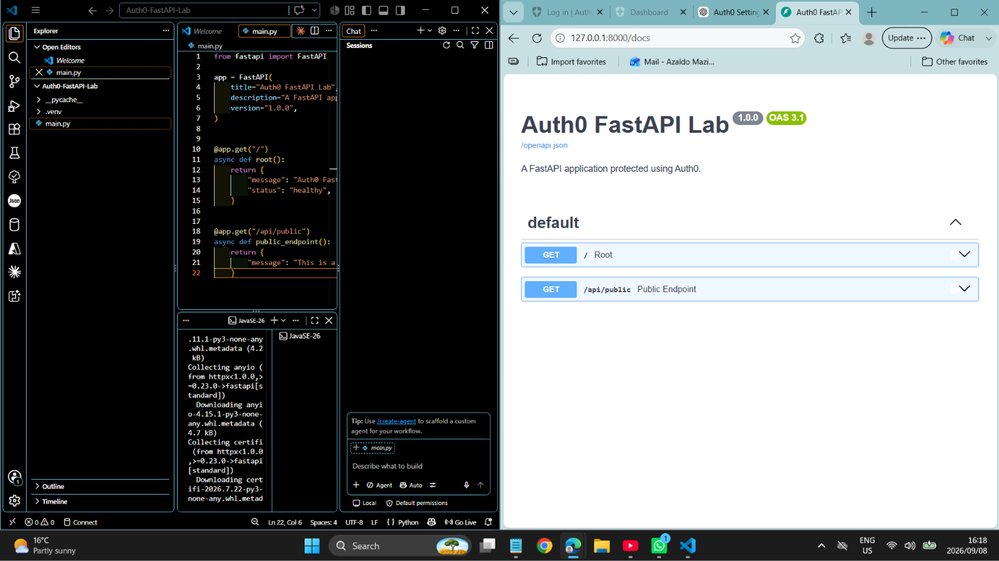
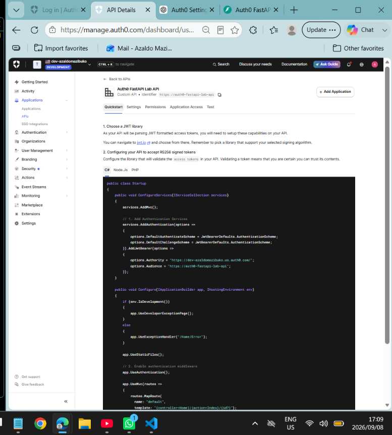
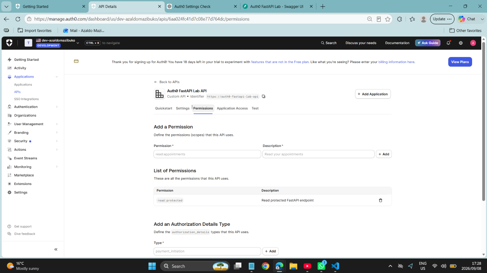
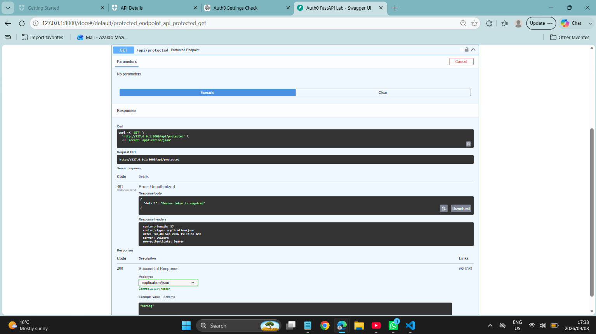
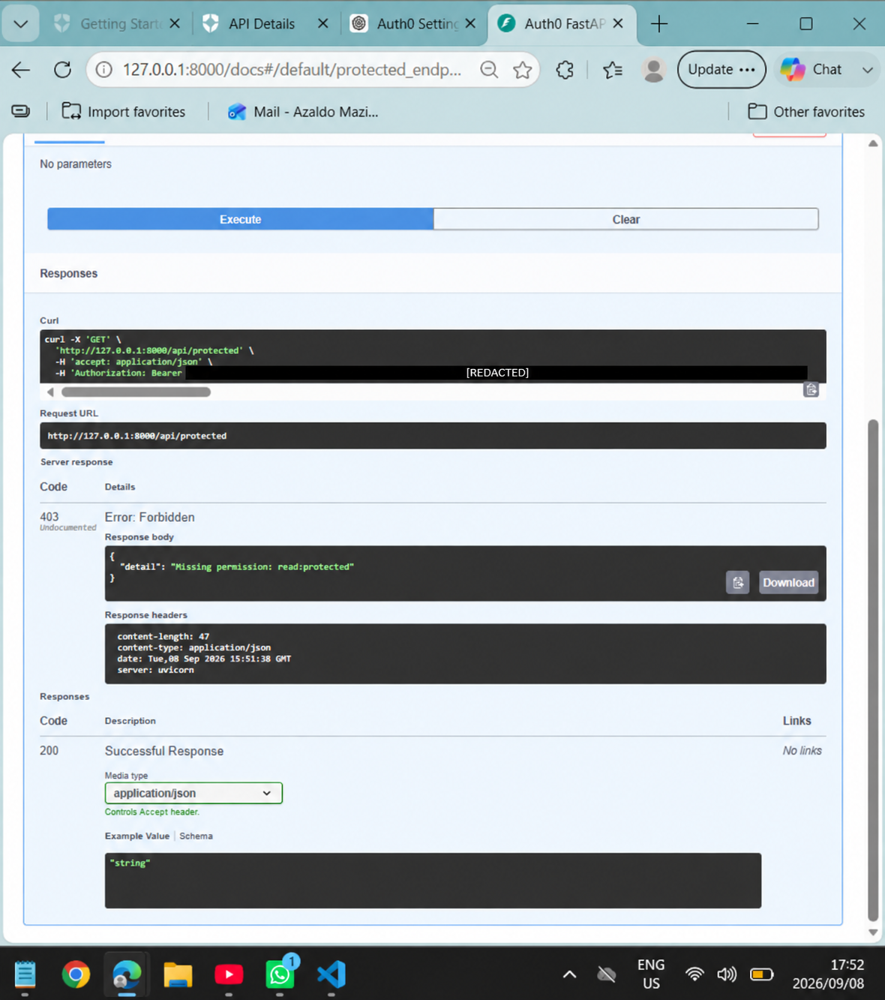
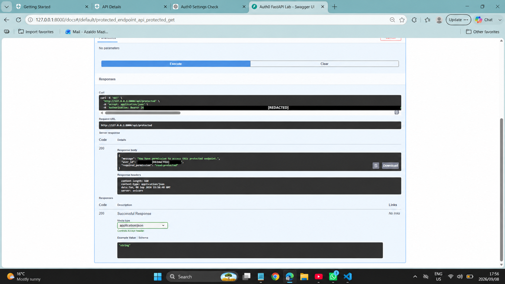

# Part 2 — Protecting a FastAPI API with Auth0

A security-focused Python API demonstrating authentication and permission-based authorization using FastAPI and Auth0.

## What this part demonstrates

- A public endpoint accessible without authentication
- A protected endpoint requiring a valid Auth0 access token
- RS256 JWT signature validation through Auth0's JWKS endpoint
- Issuer, audience and expiration validation
- Permission-based authorization using `read:protected`
- Secure environment-variable management

## Authentication and authorization flow

1. A client requests an access token from Auth0.
2. Auth0 issues an RS256-signed JWT for this API.
3. The client sends the token using the `Authorization: Bearer <token>` header.
4. FastAPI obtains Auth0's public signing key from the JWKS endpoint.
5. FastAPI validates the signature, issuer, audience and expiration.
6. The protected endpoint checks for the `read:protected` permission.
7. Access is granted with `200`, rejected without authentication with `401`, or rejected without permission with `403`.

## API endpoints

| Method | Endpoint | Access |
|---|---|---|
| GET | `/` | Public health check |
| GET | `/api/public` | Public |
| GET | `/api/protected` | Valid token with `read:protected` |
| GET | `/docs` | Swagger UI documentation |

## Evidence

All sensitive bearer tokens and identifiers shown in the authorization tests have been redacted.

| API setup | Permission configuration |
|---|---|
|  |  |
|  |  |

| Authorization denied | Authorization granted |
|---|---|
|  |  |

## Local setup

```bash
python -m venv .venv
```

Activate the environment on Windows:

```cmd
.venv\Scripts\activate
```

Install dependencies:

```bash
python -m pip install -r requirements.txt
```

Copy `.env.example` to `.env`, then configure your Auth0 domain and API audience:

```env
AUTH0_DOMAIN=your-auth0-domain.auth0.com
AUTH0_AUDIENCE=https://auth0-fastapi-lab-api
AUTH0_ALGORITHMS=RS256
```

Run the application:

```bash
fastapi dev main.py
```

Open `http://127.0.0.1:8000/docs`.

## Security notice

Never commit `.env`, client secrets, access tokens, passwords, or unredacted authentication screenshots.

