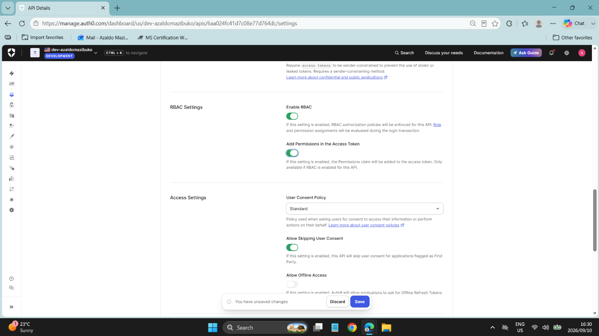
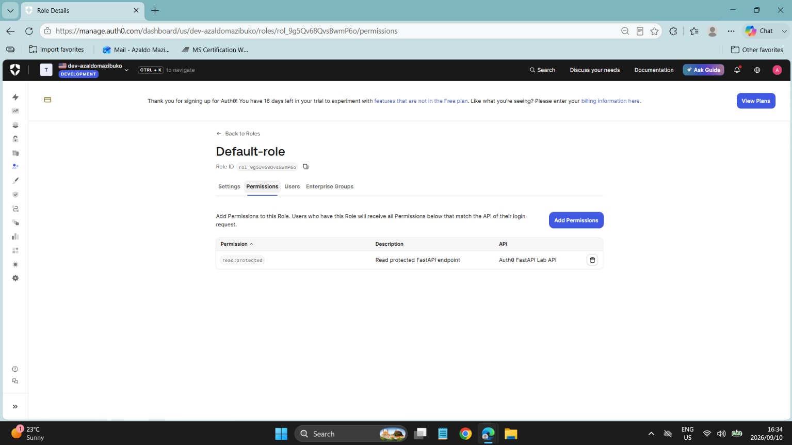
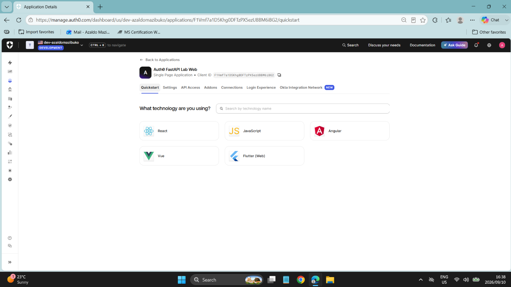
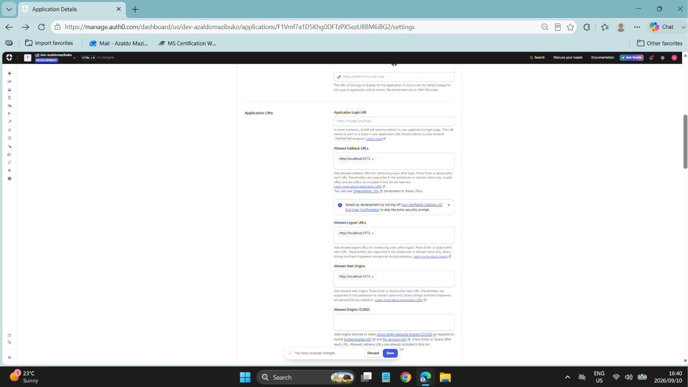
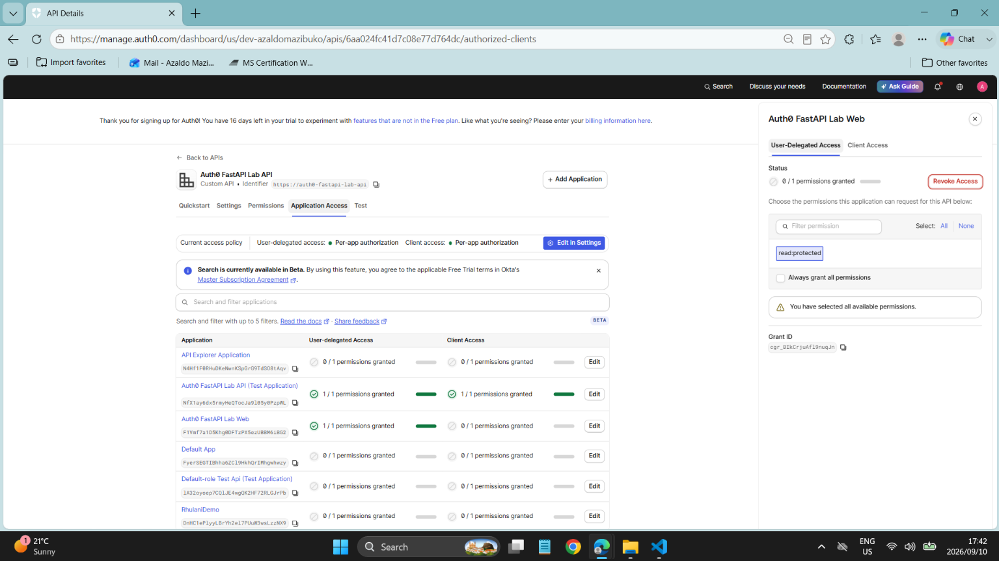
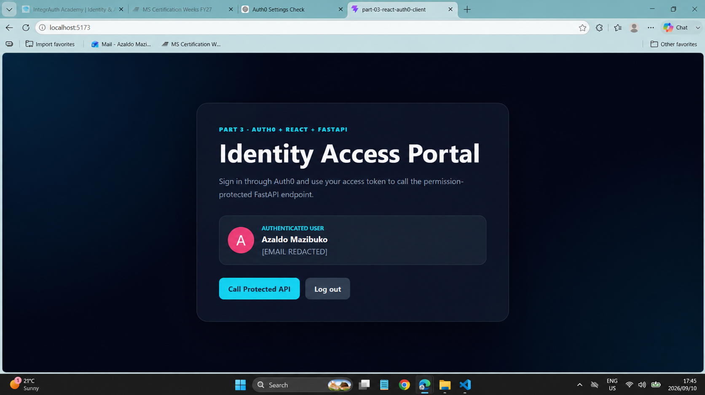
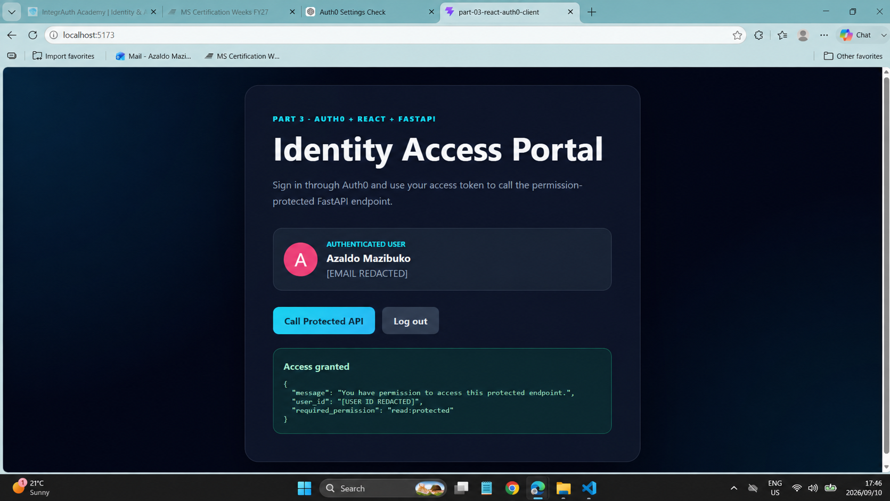

# Part 3 — React Auth0 Client

Part 3 adds a JavaScript React single-page application to the Auth0 IAM and API Security Lab. A human user authenticates through Auth0 Universal Login, obtains an OAuth 2.0 access token using Authorization Code Flow with PKCE, and calls the permission-protected FastAPI endpoint created in Part 2.

## What this demonstrates

- React authentication with the Auth0 React SDK
- Authorization Code Flow with PKCE
- OAuth 2.0 access tokens and OIDC user identity
- Audience and scope selection
- Role-based permission assignment with `read:protected`
- Browser-to-API Bearer token requests
- FastAPI JWT verification and permission enforcement
- Least-privilege, per-application API access

## Architecture

1. The user selects **Log in with Auth0** in the React application.
2. Auth0 Universal Login authenticates the user.
3. Auth0 issues an access token for `https://auth0-fastapi-lab-api`.
4. React places the token in the `Authorization: Bearer` header.
5. FastAPI validates the RS256 signature, issuer, audience, expiry and `read:protected` permission.
6. FastAPI returns the protected response only when every check passes.

## Local setup

Create `.env` from `.env.example`, then provide your own Auth0 domain and SPA client ID.

```env
VITE_AUTH0_DOMAIN=your-auth0-domain.auth0.com
VITE_AUTH0_CLIENT_ID=your-spa-client-id
VITE_AUTH0_AUDIENCE=https://auth0-fastapi-lab-api
VITE_API_URL=http://127.0.0.1:8000
```

Install and run the frontend:

```bash
npm install
npm run dev
```

Run Part 2 separately on `http://127.0.0.1:8000`.

## Evidence

| Configuration | Authorization |
| --- | --- |
|  |  |
|  |  |
|  |  |

### End-to-end protected API result



Sensitive email and Auth0 user identifiers are redacted from the public evidence.

